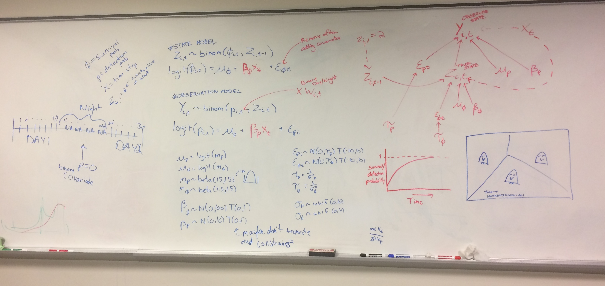

# penguin_watch
Private repo for Penguin Watch mark-recapture model

Data processing scripts largely written in Summer 2018 located in 'pwatch' repo (public).

The most recent working script is located in `HPC/model_script`. Tweaks are continually being made. 

All model runs being performed on high performance computing cluster. PBS script for cluster is `HPC/pwatch.pbs`. Model output is located in `HPC/Archive`, though some data objects are too large to be commited to git and were transfered to local machine via `scp`.

